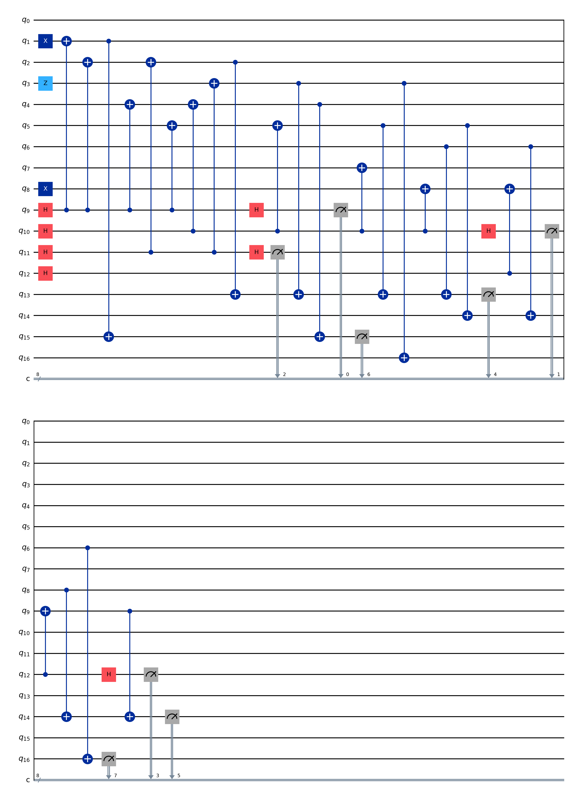

# SurfaceCode

This is the implementation of surfacecode


# Example


You can initialize a 4*4 surface code object by:

```python
from surface import surfaceCode
surf=surfaceCode(4)
surf.draw_surface()
```


The output looks like

```bash
    Q1----Q2----Q3----Q4
    |    |     |     |
    |    |     |     | 
    Q5----Q6----Q7----Q8
    |    |     |     |
    |    |     |     | 
    Q9---Q10---Q11---Q12
    |    |     |     | 
    |    |     |     |
    Q13--Q14---Q15---Q16   
```


You can print all stabilizers of the surface code by calling the following command


```python
surf.print_stab()
```

The output is:

```bash
X1-X2-X5-X6
X3-X4-X7-X8
X6-X7-X10-X11
X9-X10-X13-X14
X11-X12-X15-X16
X2-X3
X14-X15
Z2-Z3-Z6-Z7
Z5-Z6-Z9-Z10
Z7-Z8-Z11-Z12
Z10-Z11-Z14-Z15
Z1-Z5
Z9-Z13
Z4-Z8
Z12-Z16
```


To compile the syndrome extraction circuit to qiskit, call


```python
surf.compile_syndrome_circuit()
circuit=surf.get_circuit()
circuit.draw('mpl')
```

You can also print the stabilizer check matrix of the code by:


```python
H=surf.get_check_matrix()
print(H)
```


You can inject pauli error and run statevector simulation by:

```python
suf=surfaceCode(3)
suf.inject_error({1:'X'})
suf.compile_syndrome_circuit()
result=suf.run_simulation(1)
print(result)
```


An example of compiled circuit with injected pauli error is


```python
suf=surfaceCode(3)
suf.inject_error({1:'X',3:'Z',8:'X'})
suf.compile_syndrome_circuit()
circuit=suf.get_circuit()
circuit.draw('mpl')
```

The output is 




